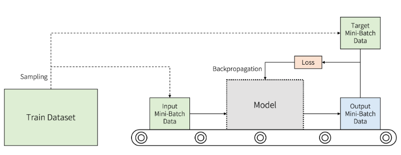
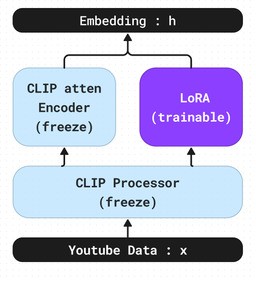
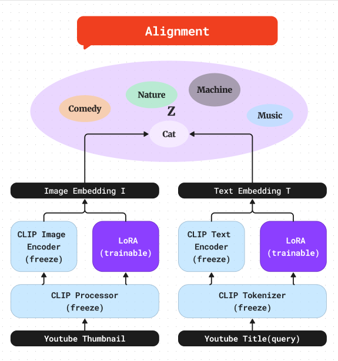
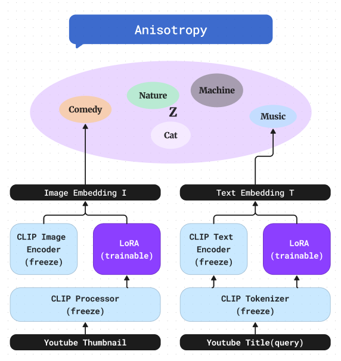

# <center> Vector Universe </center>
---

<center>


</center>

#### <center> JoongHyun Shin </center>

<br>

##### <right>#CLIP #LoRA #Embeddings #Youtube Multimodal </right>

---
# 1. Datasets



#### youtube thumbnails data

$I^{(i)}$ : youtube thumbnail Image data $i$
$T^{(i)}$ : youtube Title data $i$
$Y^{(i)}$ : youtube Label data $i$

#### Example 

$I^{(i)}$ : 

$T^{(i)}$ : **Cutest Cats Compilation 2017 | Best Cute Cat Videos Ever**

$Y^{(i)}$ : **Animal, Cat, Blog, daily**

---
# 2. Model & Loss Architecture

>####Model Architecture
### LoRA




reference
https://velog.io/@blackeyes0u0/%EB%85%BC%EB%AC%B8%EB%A6%AC%EB%B7%B0-LoRA-Low-Rank-Adaptation-of-Large-Language-Models

---

>####Loss Architecture

# 3. Objective function

<!-- N = batch_size -->
<!-- sim  = cosine, mutual information, euclidean distance -->

$$
\mathcal{L} = \sum_{i=1}^{N} log \exp^ {-\frac{1}{\tau}  sim(h_i,h_i^+)} (Alignment)
$$

$$
+\sum_{i=1}^{N} log \sum_{j \neq i}^{N} \exp^{\frac{1}{\tau} sim(h_i,h_j)} (Anisotropy)
$$


reference :
https://github.com/Blackeyes0u0/Blackeyes0u0-paper-review/blob/master/papers/Language/simCSE/simcse.md


### Alignment Loss




---

### Anisotropy Loss


## **3. Objective Funciton**


#### MLE

$\sum_{i=1}^{N} -P(Y^{(i)}) \log P(X^{(i)}|\theta)$


<!-- 
<br>

#### Preprocess & Tokenize
$I_{}^{\prime(i)} = Preprocesser(I^{(i)})$ : CLIP  Preprocess (parameter freeze $\Phi_0$)

$T_{}^{\prime(i)} = Tokenizer(T^{(i)})$ : CLIP Tokenizer (parameter freeze $\Phi_0$)

$Y_{}^{\prime(i)} = Tokenizer(Y^{(i)})$ : CLIP Tokenizer (parameter freeze $\Phi_0$)


<br>

#### Embeddings 
$E_I(I_{}^{\prime(i)};\theta_I)$ : CLIP Image Encoder + LoRA  (learnable params : $\theta_I$)
$E_T(T_{}^{\prime(i)};\theta_T)$ : CLIP Text Encoder + LoRA (learnable params : $\theta_T$)

$E_T(Y_{}^{\prime(i)};\theta_T)$ : CLIP Text Encoder + LoRA (learnable params : $\theta_T$)

#### Concat Image embeddings and Text embeddings

$X^{(i)} = f^{}(E_I(I_{}^{\prime(i)}),E_T(T_{}^{\prime(i)});\Psi)$

$f(\cdot)$ : Image + Text concat models (learnable params : $\Psi$)

<br>

#### Kernel method 

$\psi(X^{(i)})^T \cdot \phi(E_T(Y_{}^{\prime(i)}))$

<br>
miminize KL-divergence
-->


---

### Installation 

#### transformers & peft & loralib

🤗 Transformers is tested on Python 3.6+, PyTorch 1.1.0+, TensorFlow 2.0+, and Flax. Follow the installation instructions below for the deep learning library you are using:

PyTorch installation : [pytorch](https://pytorch.org/get-started/locally/)

TensorFlow 2.0 installation instructions : [tensorflow](https://www.tensorflow.org/install/pip)
Flax installation instructions.[Flax](https://flax.readthedocs.io/en/latest/)


```
python -m venv .env
```
Activate the virtual environment. On Linux and MacOs:

```
source .env/bin/activate
```
Activate Virtual environment on Windows
```
.env/Scripts/activate
```
Now you’re ready to install 🤗 Transformers with the following command:
```
pip install transformers
```
For CPU-support only, you can conveniently install 🤗 Transformers and a deep learning library in one line. For example, install 🤗 Transformers and PyTorch with:
```
/VectorUniverse Project X
├── README.md
├── Data
|  ├── VQA
|  └── Youtube_thumbnails
|       ├── images
|       └── metadata.csv
|
├── node_modules
|  ├── bluebird
|  ├── chalk
|  ├── cli-spinner
|  ├── meow
|  └── object-assign
├── package.json
└── tree.js
```
