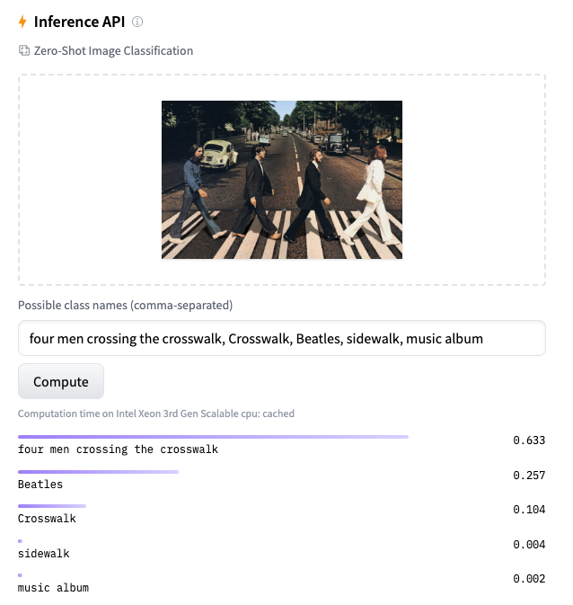
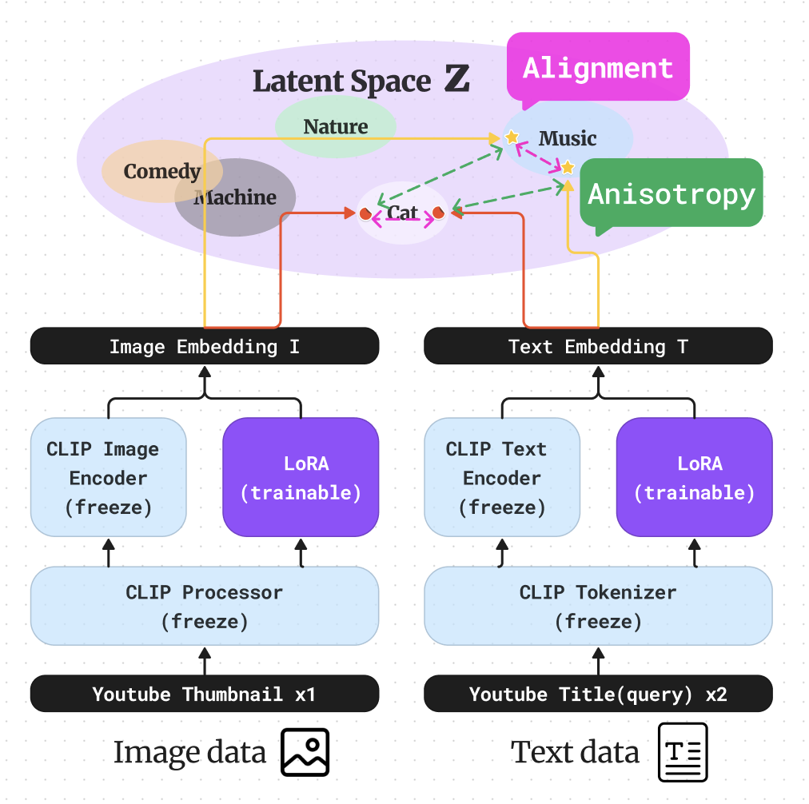
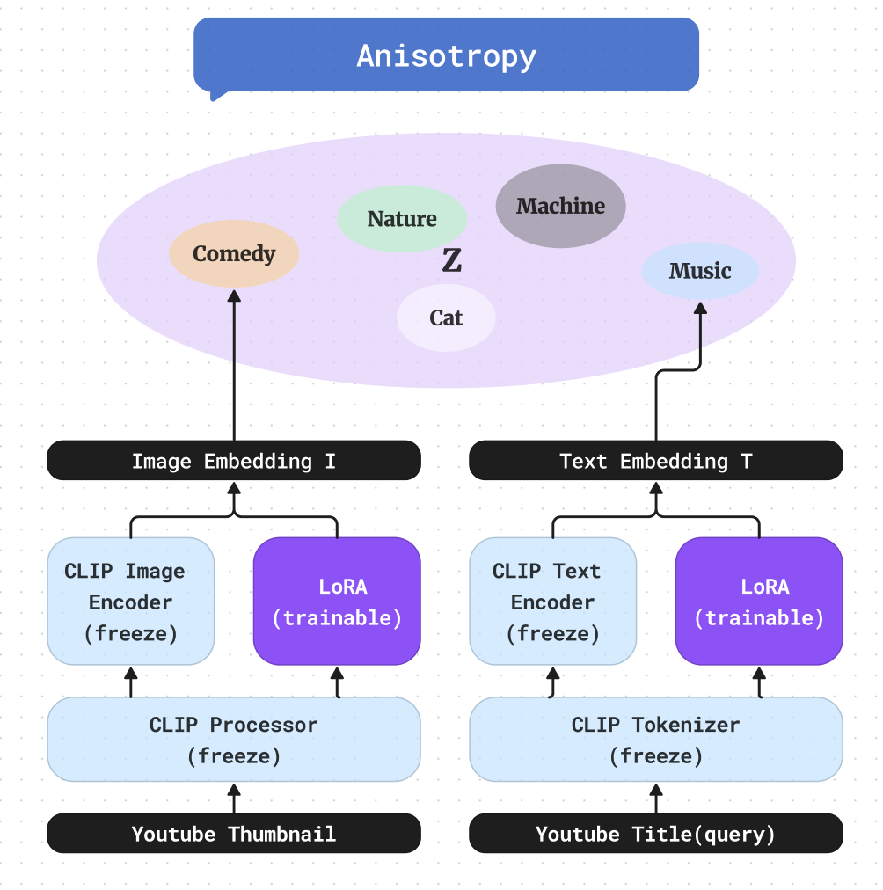

# <center> Vector Universe </center>
---

<center>


</center>

#### <center> JoongHyun Shin </center>

<br>

##### <right>#CLIP #LoRA #Embeddings #Youtube Multimodal </right>

---


# Demo


**huggingface space에 데모 버전을 올려놓았습니다.**

### [Click](https://huggingface.co/Soran/youtube_CLIP_LoRA_SimCSE)




# 1. Datasets & DataLoader

<!--  -->

#### youtube thumbnails data

$I^{(i)}$ : youtube thumbnail Image data $i$
$T^{(i)}$ : youtube Title data $i$

<!-- #### Example 

$I^{(i)}$ : 

$T^{(i)}$ : **Cutest Cats Compilation 2017 | Best Cute Cat Videos Ever** -->


---
# 2. Model & Loss Architecture

<!-- 
 -->

<!--  -->


위 모델 아키텍쳐를 보면 Latent space 상에서 이미지 임베딩과 텍스트 임베딩의 거리를 가깝게 하는것을 alignment, 멀게하는것을 Uniform라고 정의하였습니다.

### [model 설명](https://velog.io/@blackeyes0u0/youtube-CLIP-LoRA-SimCSE-%EA%B2%B0%EA%B3%BC)

### [LoRA 논문 리뷰](https://velog.io/@blackeyes0u0/%EB%85%BC%EB%AC%B8%EB%A6%AC%EB%B7%B0-LoRA-Low-Rank-Adaptation-of-Large-Language-Models)


---


# 3. Objective function

$$
h_i = f(x_i)
$$

$$
\mathcal{L}_i=-\log \frac{e^{\operatorname{sim}( {h}_i^{z_i}, {h}_i^{z_i^{\prime}}) / \tau }}{\sum_{j=1}^N e^{\operatorname{sim}({h}_i^{z_i}, {h}_j^{z_j^{\prime}}) / \tau}}
$$

$i$ 번째 데이터와 $N$개의 batch_size pair 대해서 위와 같이 표현 할 수있다. 

$h_i$는 데이터의 임베딩에 해당하고, $z_i$는 각 데이터에 가한 augmentation에 해당한다. $\tau$는 하이퍼파라미터 temperature값이다.


<!--  -->

<!--  -->

$$
\mathcal{L} = \sum_{i=1}^{N} log \exp^ {-\frac{1}{\tau}  sim(h_i,h_i^+)} (Alignment)
$$

$$
+\sum_{i=1}^{N} log \sum_{j=1 }^{N} \exp^{\frac{1}{\tau} sim(h_i,h_j)} (Uniform)
$$


여기서 나오는 sim은 similarity의 약자이고, cosine similarity를 사용하였습니다.

### Notation

i번째 image embedding : $I_i$ 는 row vector

i번째 text embedding : $T_i$

**(단, $I_i,T_j,I_i^+,T_j^+$는 1로 normalize)**

코드 상에서는 cosine similarity를 사용해서 normalize하였습니다.

$$
I_i = \mathbb M(batchsize,d=512)[i]
$$

## Image Text Alignment & Uniform

$$
alignment = -\sum_i tr(II^{+T}+I T^T+ I^+ T^{+T}+TT^{+T})
$$


먼저 위 Object function에서 Uniform식이 아래와 같이 되기 위해서는 convex function라고 가정하고, jensen's inequality를 사용한 결과입니다.

$$
Uniform = \sum_i \sum_{j } I_i \cdot T_j^T + \cdots \\
= sum(II^{+T}+I T^T+ I^+ T^{+T}+TT^{+T})
$$


위 식을 분산과 평균 관점에서 다시 바라보았습니다.
$I_i$가 한개의 임베딩 값이라고 하고, 이 값들은 각 평균과 분산을 갖는다고 하면, 적절한 임베딩은 어느 한 차원으로 쏠리지 않고 적절하게 분산되어서 표현되는것 입니다.

이것에 대한 솔루션으로는 PCA whitening과 batch normalization이가 생각이 납니다. 무엇을 사용해야할지는 알기 위해 수식을 전개해 보았습니다.

$$
I_i = \mu +\sigma_i \\
\mu = \frac{1}{N}\sum_{i \in \chi}^N I_i\\
\therefore \frac{1}{N}\sum_{i \in \chi}^N \sigma_i = 0
$$
$I$만 생각해보면,
$$
\frac{1}{N^2}\sum_{i \in \chi}^N \sum_{j \in \chi}^N I_i \cdot I_j^T 
$$

$$
= \frac{1}{N^2}\sum_{i \in \chi}^N \sum_{j \in \chi }^N (\mu +\sigma_i ) \cdot (\mu +\sigma_j )^T
$$

$$
=\mu \mu^T + \frac{1}{N^2}\sum_{i \in \chi }^N \sum_{j \in \chi}^N \sigma_i \cdot \sigma_j^T \\
=  I \cdot I^T = A
$$

가 되어서 뜻을 해석해보면 임베딩의 평균값을 낮추고, 분산의 곱을 낮추는 식이다. 또한, 위 식은 symmetric matrix이기 때문에 항상 diagonalizable하고, 그 eigen vector는 orthogonal 합니다.

그러한 경우를 eigen decompositoin해서 생각해보자.
$A$라고 놓은 행렬을 $A P_i = \lambda_i P_i$라고 생각해보자. 이때 $P_i$는 $\lambda_i$에 대한 eigen vector입니다.

$$ 
A = P DP^T
$$

이때, $PP^T = E$ 즉, orthogonal하므로, 

$$
A = \sum_i \lambda_i P_i \cdot P_i^T
$$

$\lambda_i$의 어느 한값이 크다는 것은 데이터가 골고루 퍼져있기보단, 한 방향으로 치우쳐져있는것이다. 따라서 위 eigen value값을 골고루 만드느것이 여기서 나온 Uniform의 목적입니다. 

### Flatten Embedding

위 목적을 이루기 위해서 어떻게 해야할까요??

만약에 $I_i$가 normalize 되어있다고 한다면, $tr(A)$의 값은 sum of eigen value이고, constant할것이다. 왜냐하면 diagonal element가 모두 1이기 때문에.
그렇다면 largest eigen value의 값을 줄이고, smallest한 eigen value의 값을 키우면 됩니다. 

만약에 , A의 값들이 모두 양수이고, $sum(P_i \cdot P_i^T)$가 양수라면 sum($A$)를 largest eigen value의 upper bound와 비례한다고 놓을 수 있다. 그래서 위 sum을 줄이는것이, flatten embedding을 하면서 negative pair끼리의 임베딩을 할 수 있습니다. 

SimCSE 논문의 아이디어를 인용하였습니다.
https://arxiv.org/abs/2104.08821

[SimCSE 논문리뷰](https://github.com/Blackeyes0u0/Blackeyes0u0-paper-review/blob/master/papers/Language/simCSE/simcse.md)

---

## Flatten different Embeddings

하지만 나는 그렇게 조건을 줄 수 없기에, 다른 방식을 생각해야 했습니다. 이유, 다른 임베딩끼리의 표현이기 때문에..

그래서 위처럼 negative pair loss와 Uniform를 하나의 식으로 보지않고, 따로 볼 생각입니다.
이제 I와 T에 대해서 생각해 봅시다.

### negative pair loss

$$
\frac{1}{N^2}\sum_{i \in \chi }^N \sum_{j  \in \Chi}^N I_i \cdot T_j^T 
$$

$$
= \frac{1}{N^2}\sum_{i \in \chi}^N \sum_{j  \in \Chi}^N (\mu^{(Image)} +\sigma_i^{(Image)} ) \cdot (\mu^{(Text)} +\sigma_j^{(Text)} )^T
$$

$$
=\mu^{(Image)} \mu^{(Text)T} + \frac{1}{N^2}\sum_{i \in \chi}^N \sum_{j  \in \Chi}^N \sigma_i \cdot \sigma_j^T
$$

직관적인 의미를 보자면, 이미지와 텍스트의 평균 값을 줄이고, 각 이미지와 텍스트 임베딩의 서로 다른 분산 임베딩을 줄이는 것입니다. 먼저 이걸로, negative pair끼리의 dot product값을 줄여, cosine similarity를 줄일 수 있습니다. 


<!-- 
<br>

#### Preprocess & Tokenize
$I_{}^{\prime(i)} = Preprocesser(I^{(i)})$ : CLIP  Preprocess (parameter freeze $\Phi_0$)

$T_{}^{\prime(i)} = Tokenizer(T^{(i)})$ : CLIP Tokenizer (parameter freeze $\Phi_0$)

$Y_{}^{\prime(i)} = Tokenizer(Y^{(i)})$ : CLIP Tokenizer (parameter freeze $\Phi_0$)


<br>

#### Embeddings 
$E_I(I_{}^{\prime(i)};\theta_I)$ : CLIP Image Encoder + LoRA  (learnable params : $\theta_I$)
$E_T(T_{}^{\prime(i)};\theta_T)$ : CLIP Text Encoder + LoRA (learnable params : $\theta_T$)

$E_T(Y_{}^{\prime(i)};\theta_T)$ : CLIP Text Encoder + LoRA (learnable params : $\theta_T$)

#### Concat Image embeddings and Text embeddings

$X^{(i)} = f^{}(E_I(I_{}^{\prime(i)}),E_T(T_{}^{\prime(i)});\Psi)$

$f(\cdot)$ : Image + Text concat models (learnable params : $\Psi$)

<br>

#### Kernel method 

$\psi(X^{(i)})^T \cdot \phi(E_T(Y_{}^{\prime(i)}))$

<br>
miminize KL-divergence
-->


---

### Installation 

```bash
pip install transformers
pip install peft
pip install loralib
pip install wandb
```

#### file

<!-- 🤗 Transformers is tested on Python 3.6+, PyTorch 1.1.0+, TensorFlow 2.0+, and Flax. Follow the installation instructions below for the deep learning library you are using:

PyTorch installation : [pytorch](https://pytorch.org/get-started/locally/)

TensorFlow 2.0 installation instructions : [tensorflow](https://www.tensorflow.org/install/pip)
Flax installation instructions.[Flax](https://flax.readthedocs.io/en/latest/)


```
python -m venv .env
```
Activate the virtual environment. On Linux and MacOs:

```
source .env/bin/activate
```
Activate Virtual environment on Windows
```
.env/Scripts/activate
```
Now you’re ready to install 🤗 Transformers with the following command:
```
pip install transformers
```
For CPU-support only, you can conveniently install 🤗 Transformers and a deep learning library in one line. For example, install 🤗 Transformers and PyTorch with: -->

```
/VectorUniverse Project X
├── README.md
├── Data
|  ├── VQA
|  └── Youtube_thumbnails
|       ├── images
|       └── metadata.csv
|
├── node_modules
|  ├── bluebird
|  ├── chalk
|  ├── cli-spinner
|  ├── meow
|  └── object-assign
├── package.json
└── tree.js
```
